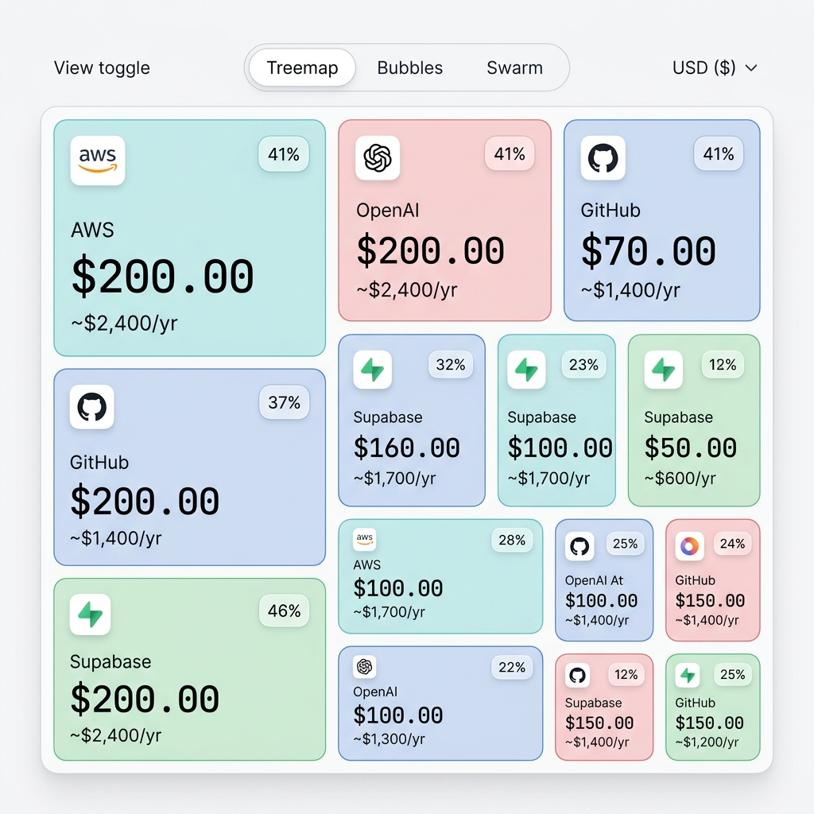

# RunwayMap

[](LICENSE)
[](https://github.com/Hubrisdog/runwaymap/pulls)
[](https://github.com/Hubrisdog/runwaymap)
[](https://github.com/Hubrisdog/runwaymap)

> **Before you hire, subscribe, or cut costs, see exactly how it affects your runway.**

**RunwayMap** is a premium, interactive B2B **Finance Operations Cockpit** designed for startup founders, finance teams, and CFOs. It allows companies to map out SaaS stack costs, model headcount expansions, simulate price surges, and perform dynamic A/B stress testing to predict capital efficiency impacts before they happen.



---

## One Cockpit. Two Audiences.

RunwayMap features a dynamic dashboard mode toggle in the header, catering to different business sizes:

### Basic Mode (Founders & Indie Hackers)
* **Goal:** Simplify financial monitoring.
* **Features:** Hides advanced CFO inputs to prevent cognitive overload. Displays:
  - Core KPIs (Monthly Burn, Runway Remaining, Health Score)
  - Squid Squarified Treemap (spend visualizer)
  - Simple Sliders (Starting Cash & Virtual Team Growth)
  - Cost Optimization Engine suggestions

### Pro Mode (CFOs & Finance Teams)
* **Goal:** Full-scale treasury and budget governance.
* **Features:** Unlocks deep analytics:
  - Scenario saves and comparison matrixes
  - All visualizer views (Circlepack Vendor Concentration and Beeswarm plots)
  - Advanced Sliders (Hiring pipelines, average salaries, Cloud API usage surges)
  - Plaid Bank Feeds Statement Sync simulations
  - Department budget caps, timeline calendars, and alerts simulators

---

## Key Features

### 100-Point Financial Health Score
Replaces simple risk alerts with a comprehensive, real-time grading system. It dynamically calculates points across five dimensions:
1. **Runway Durability (35 pts):** Capital runway survival length.
2. **Vendor Concentration (20 pts):** Single-vendor exposure warnings.
3. **Renewal Clustering (15 pts):** Cash-flow warnings for clustered renewals in the next 7 days.
4. **Department budget caps (15 pts):** Budget cap overrun warnings.
5. **Growth assumptions & buffer (15 pts):** Burn-to-cash ratios and hiring pipeline limits.

### Scenario A/B Compare Matrix
Save active slider configurations as named scenarios (e.g. *Growth Strategy* or *Lean Run*). Open the **Compare Matrix** to see a side-by-side table displaying:
* **Δ Runway vs Active:** The gain or loss in survival months.
* **Δ Burn vs Active:** The exact burn decrease/increase per month.
* **Capital Efficiency:** The cash-to-burn ratio represented in years of durability.

### Analyst Mode
Repositioned the calligraphic sepia ledger theme into a functional financial report card. When Analyst Mode is active, a real-time monospaced markdown report breaks down capital overview, outflow shares, the 100-point Health Score points allocation, a 20% price shock simulation on your largest SaaS vendor, and optimization opportunities.

### Cost Optimization Engine
Exposes annual ARR savings through automated recommendations (e.g. Slack/Teams redundancy detections, Switch-to-Yearly 20% discount alerts, and missing owner/metadata hygiene checks) with one-click actions.

### Operations Hub
* **Calendar:** An interactive month grid showcasing renewal dates and cash collision warnings if multiple renewals hit on the same day.
* **Alerts Sim:** Preview simulated notifications (Email, Mobile Push, Slack app webhooks) sent 2 days before charge dates.
* **Departments:** Allocate and govern budget cap limits per department.

### Dual-Mode Onboarding Tour
Features separate step-by-step interactive tours for Basic Mode (11 steps) and Pro Mode (17 steps) to guide users through their specific dashboard capabilities.

---

## Technology Stack

- **Core:** Vanilla JavaScript, Semantic HTML5
- **Styling:** Custom CSS, Tailwind CSS Utility Classes
- **Typography:** JetBrains Mono, Plus Jakarta Sans (Google Fonts)
- **Logos & Icons:** img.logo.dev API, Iconify Framework
- **Screenshots:** modern-screenshot (Dom-to-Canvas PNG generator)

---

## Local Setup

Run RunwayMap locally with any static HTTP server:

### Option A: Node.js (Serve)
```bash
npx serve .
```

### Option B: Python
```bash
python -m http.server 8000
```

Open `http://localhost:8000` in your browser to view the application.

---

## License

MIT
